# Cleversort 

*Cleversort* is a workflow based collaboration application: [cleversort.com](https://cleversort.com/).
The mobile application was developed with React Native, uses Firebase as a backend, including Cloud Functions to handle notifications and database updates and also provides Google OAuth authentication, in addition to .

It manages checklists and tasks:

<a href="url">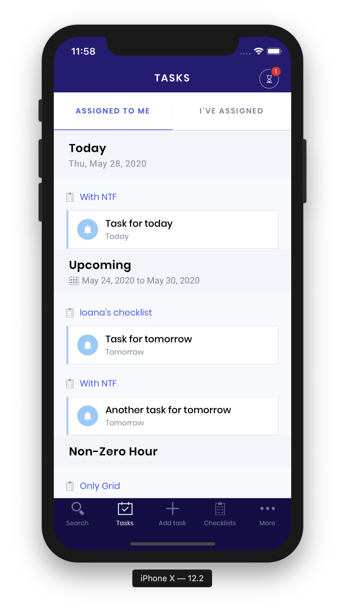</a>
<a href="url">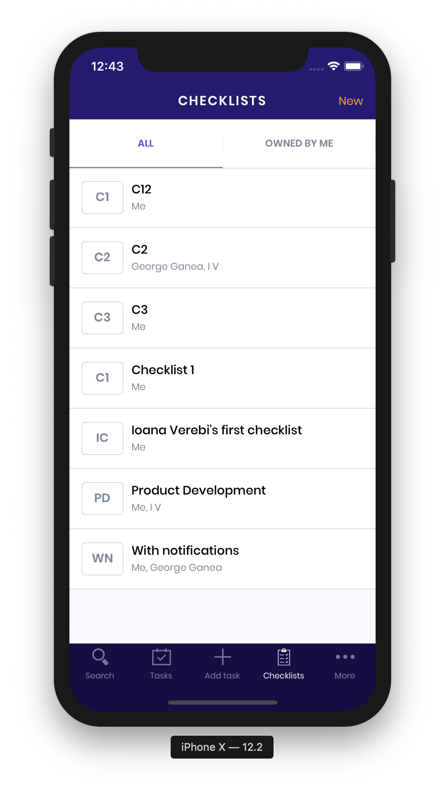</a>
<a href="url">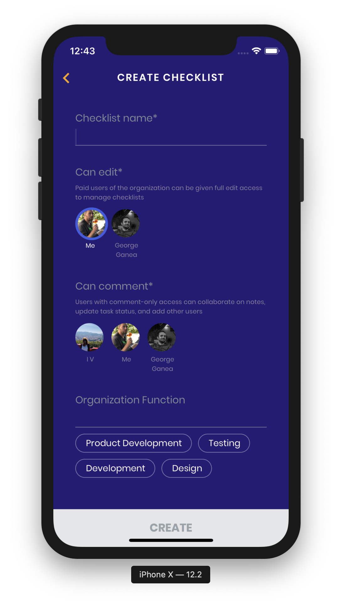</a>
<a href="url">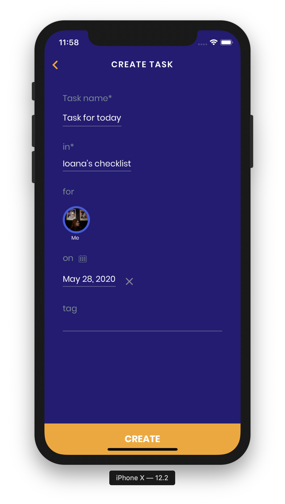</a>
<a href="url">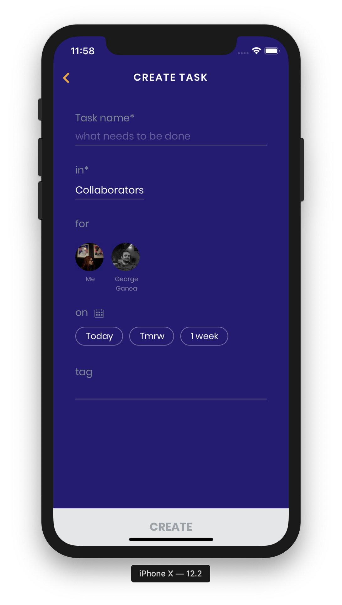</a>
<a href="url">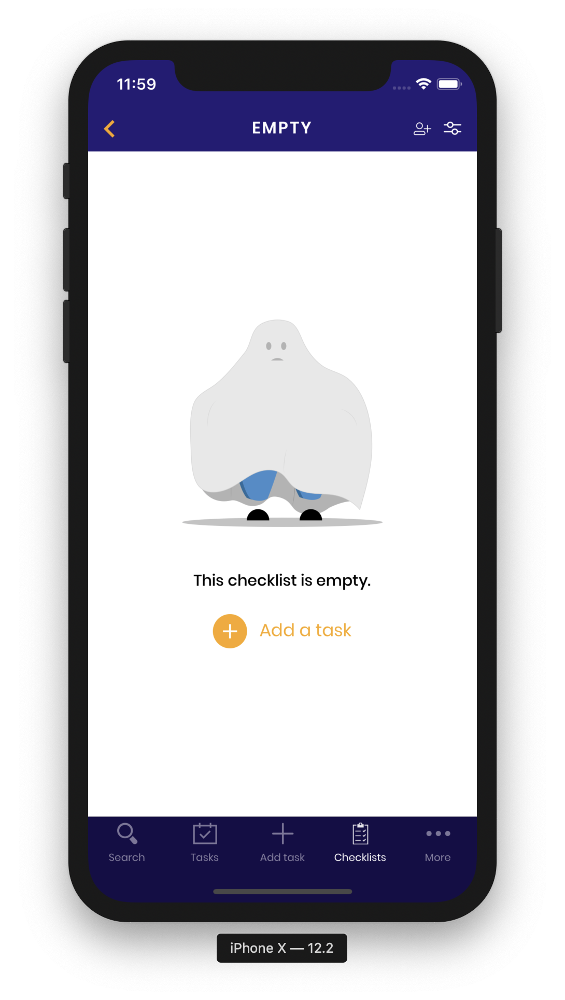</a>

It allows filtering, creating and updating tasks:

<a href="url">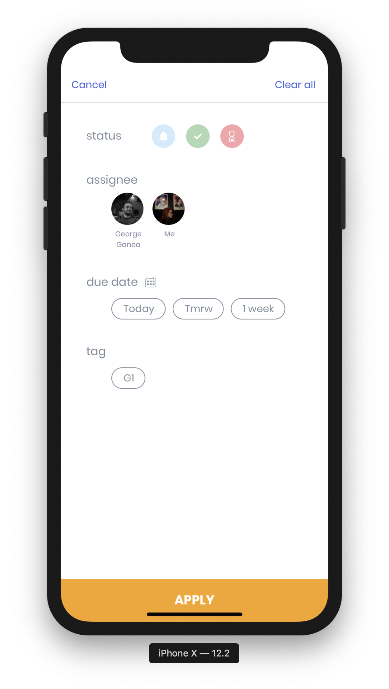</a>
<a href="url">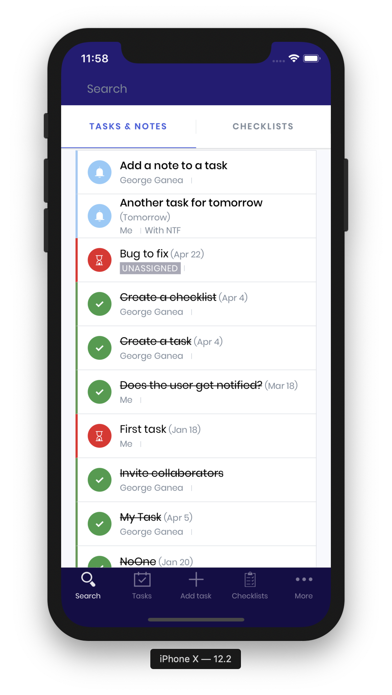</a>
<a href="url">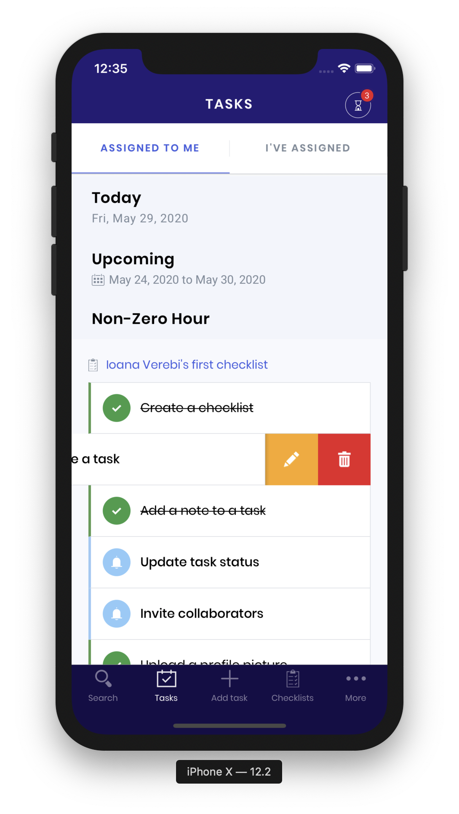</a>
<a href="url">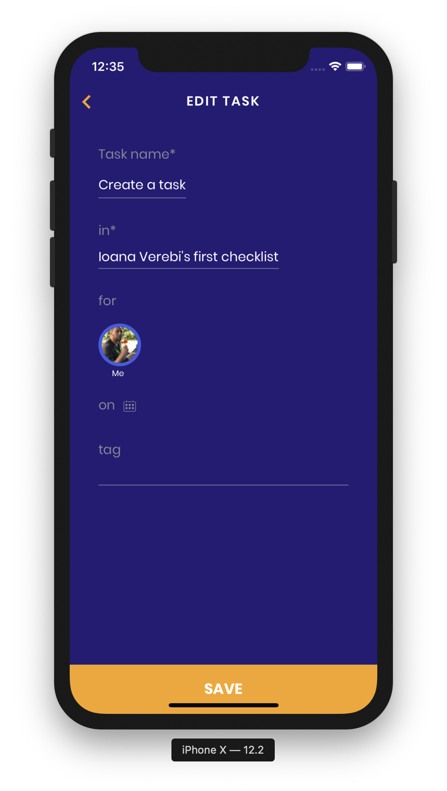</a>
<a href="url">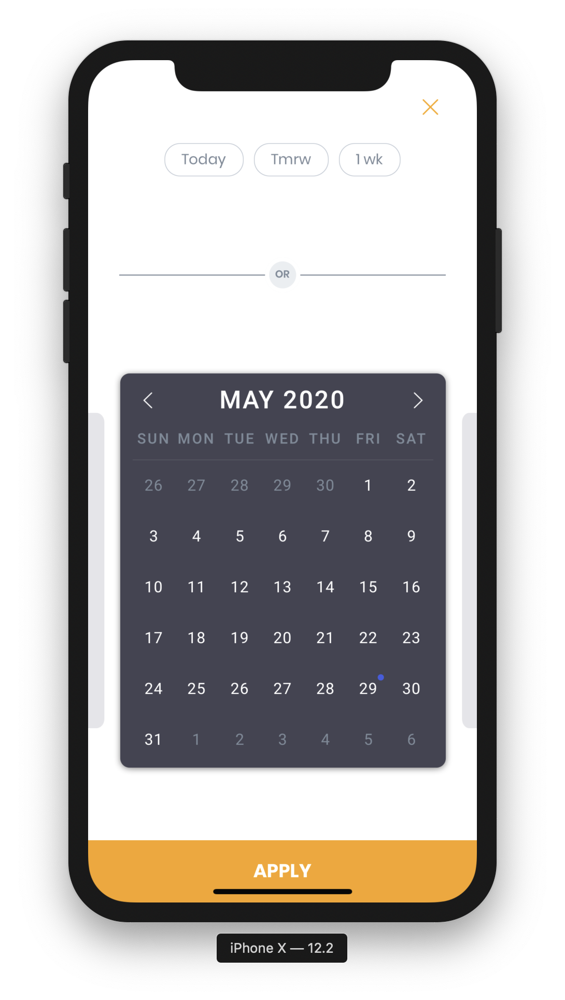</a>

The app includes notifications when a task is overdue, marked as completed, etc.
<a href="url">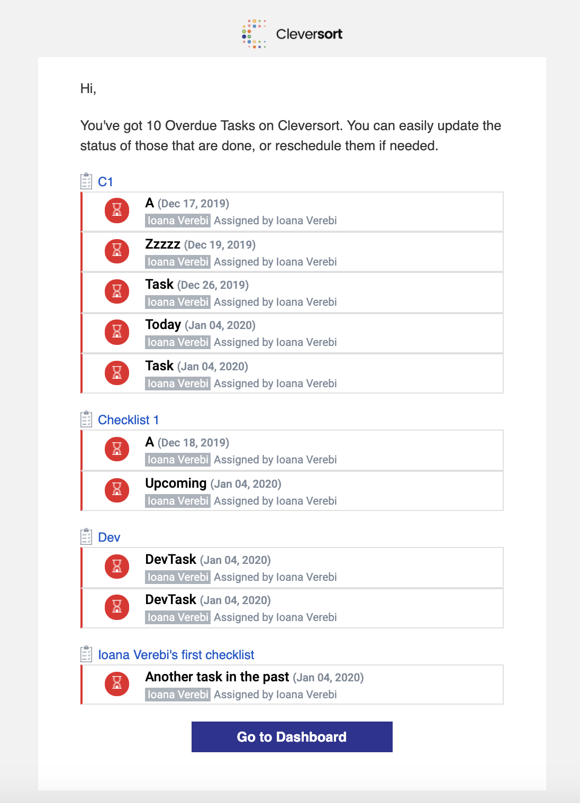</a>

And a user management and profile setup.

<a href="url">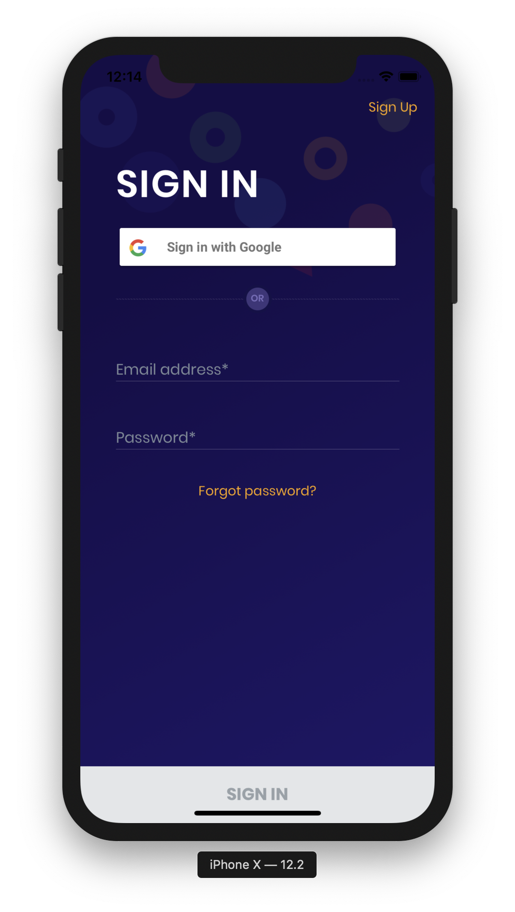</a>
<a href="url">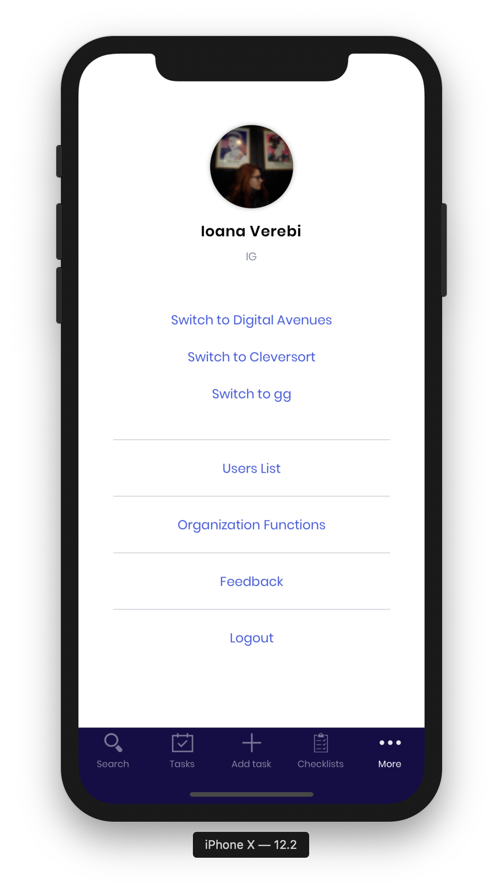</a>
<a href="url">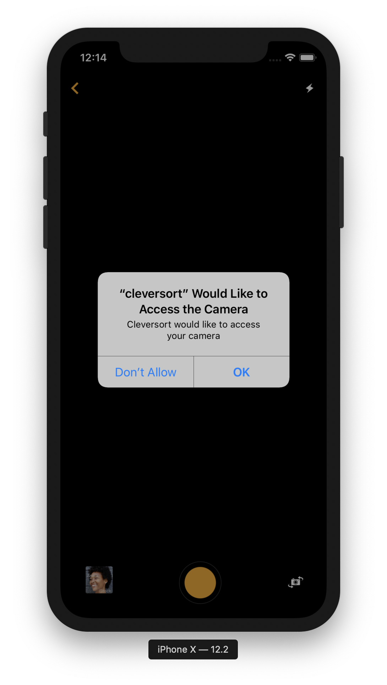</a>

